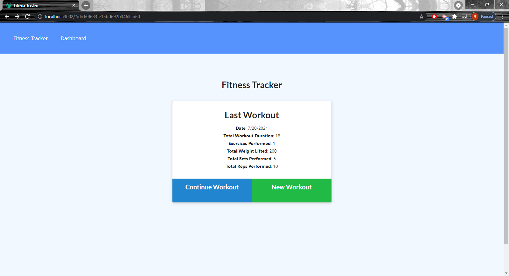
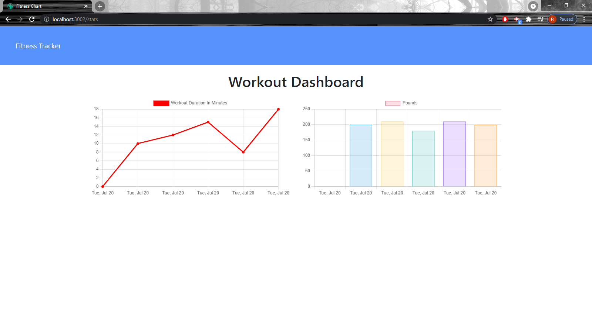
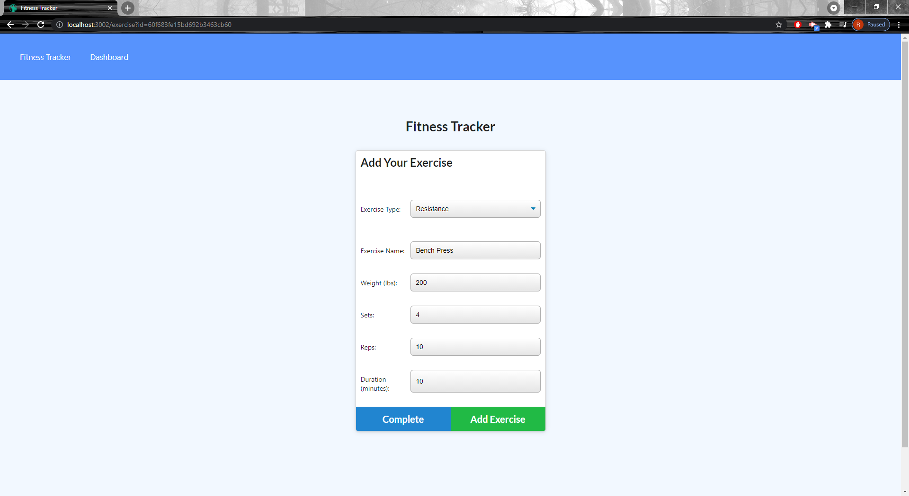

# Fitness Tracker

## Description

A simple fitness tracker that makes use of mongoDB and mongoose to store and retrieve workout data to the user.

## Table of Contents

[Usage](#usage)

[Screenshots](#screenshots)

[License](#license)

[Contribute](#contribute)

[Questions](#questions)

## Usage

To use this application, click the New Workout button and select which ever workout routine you have or would like to achieve.

## Screenshots

## License

This project is licensed under the MIT license.

## Contribute

Anyone is free to contribute however they like

## Questions

If you have any questions please visit my GitHub at https://github.com/robert-rousset or email me at robertrousset94@gmail.com.
